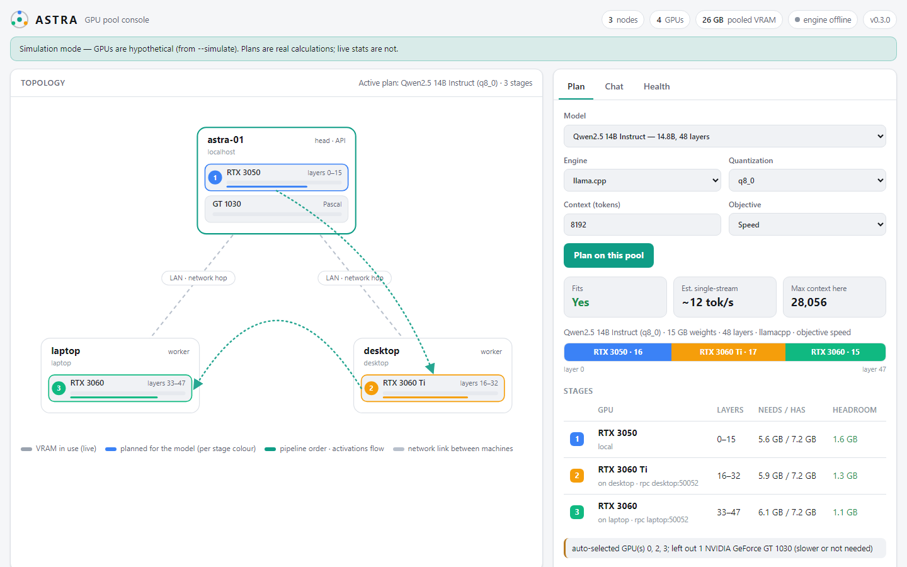

# ASTRA — Asynchronous Scalable Topology for Resource Aggregation

ASTRA is an external, modular GPU compute node ("JBOG — Just a Bunch Of GPUs").
It moves GPUs out of the host into an expansion chassis connected by native
PCIe-over-cable (OCuLink 4i). **Any mix of NVIDIA GT / GTX / RTX cards** is pooled
into one inference target, or split between services, by a software control plane.
The concept's RTX 2060 6 GB + RTX 3050 8 GB pair is the reference example.

This repository contains everything needed to build, validate, deploy and operate
the node:

| Area | Where |
|---|---|
| Governance: charter, RACI, phase gates, risks | [`docs/00-governance`](docs/00-governance) |
| Product requirements (FR/NFR IDs) | [`docs/01-requirements/PRD.md`](docs/01-requirements/PRD.md) |
| System architecture, design review, ADRs | [`docs/02-architecture`](docs/02-architecture) |
| Solution design (hardware + software), BOM | [`docs/03-solution-design`](docs/03-solution-design), [`hardware/`](hardware) |
| Engineering standards, dev setup | [`docs/04-development`](docs/04-development), [`CONTRIBUTING.md`](CONTRIBUTING.md) |
| Test strategy, test cases, traceability | [`docs/05-testing`](docs/05-testing) |
| **Testing on real hardware (what to buy, step by step)** | [`docs/05-testing/field-test-plan.md`](docs/05-testing/field-test-plan.md) |
| **Connecting more GPUs** (x16 / x8 / x4 / x1, risers, OCuLink, bifurcation, switch, network) | [`docs/03-solution-design/connecting-gpus.md`](docs/03-solution-design/connecting-gpus.md) |
| **One-command test on your PC** | `powershell -ExecutionPolicy Bypass -File scripts\stage0-test.ps1` |
| **Supported GPUs** (`astra gpus`) | [`docs/03-solution-design/supported-gpus.md`](docs/03-solution-design/supported-gpus.md) |
| Deployment guide, release process | [`docs/06-deployment`](docs/06-deployment) |
| Monitoring and runbooks | [`docs/07-operations`](docs/07-operations) |
| Control-plane source (`astra` CLI) | [`src/astra`](src/astra) |
| Containers, Compose, systemd, Prometheus, Grafana | [`deploy/`](deploy) |

## Quick start: fully automatic

```bash
pip install -e .        # once (Python 3.11+)
astra auto              # detect GPUs -> configure -> choose model -> download -> launch -> verify -> console
```

`astra auto` asks nothing. It finds every NVIDIA GPU (`nvidia-smi`, including the
GPU-to-GPU topology from `nvidia-smi topo -m`) and any other ASTRA machines on your
network. It writes the as-built config, picks the largest model that fits, downloads
llama.cpp (the right CUDA build) and the model, then starts, benchmarks and validates
it and opens the console at http://127.0.0.1:9838/. Add or remove a GPU and run it
again. `astra auto --no-launch` only shows what it would do.

## Web console

`astra ui` opens an exo-style console: every machine and GPU in the pool, where each
layer of the model runs, live GPU stats, health, and a chat box for the running
model. Try it without any hardware: `astra ui --simulate fabric-demo`, then open
http://127.0.0.1:9838/.



## The control plane in one minute

```bash
python3.11 -m venv .venv && . .venv/bin/activate && pip install -e ".[dev]"

astra compat --simulate "RTX 3060, GT 1030"     # before buying: driver, engines, PSU size
astra compat                                    # the same for the GPUs actually installed
astra probe                                     # GPUs, PCIe path, uplink bottleneck
astra probe --emit-config > astra.toml          # freeze the installed GPUs as the as-built node
astra validate                                  # Phase 2 link gate (exit 1 on FAIL)
astra plan --simulate "GT 1030, GTX 1660 SUPER, RTX 3060" \
           --model qwen2.5-14b --quant q4_k_m   # which GPUs to use, and how to split
astra plan --gguf /srv/models/model.gguf \
           --output plan.json --env-file deploy/compose/.env
docker compose -f deploy/compose/compose.yaml --profile pooled up -d
astra validate --phase runtime --plan plan.json # Phase 3 runtime gate
astra exporter                                  # Prometheus metrics on :9835
```

`astra plan` picks **which** GPUs to use and **how** to split the model. It tries
every GPU combination and keeps the fastest one that fits with margin. A 48 GB/s
GT 1030 is left out unless the model needs its memory, and then it gets only the
spill. Layers are placed so that slow cards hold less, accounting for weights, KV
cache, embedding/output tensors and a CUDA reserve. The output is the exact
`llama-server` or `vllm serve` command. With `--objective balanced` the split
follows the concept rule `VRAM_i / VRAM_total`.

**Several machines, one pool (ASTRA Fabric):** like the Mac clusters (exo/MLX),
but for NVIDIA. Run `astra agent --rpc` on every PC with GPUs; the head node
discovers them, places the model's layers across local and remote GPUs, and serves
one OpenAI-compatible endpoint through llama.cpp. Example: the chassis RTX 3050 plus
the desktop's RTX 3060 Ti serving Qwen2.5-14B together:

```bash
astra agent --rpc                    # on each GPU machine
astra cluster                        # on the head: list nodes and GPUs
astra plan --cluster --gguf qwen2.5-14b-q4_k_m.gguf --output plan.json
```

**Mixing generations — know this before you buy:** all GPUs share one driver. Any
Maxwell, Pascal or Volta card (GTX 9xx/10xx, GT 1030) limits the host to the
**R580** driver branch; newer branches (like the R610 on the dev machine) don't see
those cards at all. Kepler (GTX 6xx/7xx) is unsupported. `astra compat` checks all
of this, plus the PSU size, for any list of cards.

## Status

| Phase | Gate | State |
|---|---|---|
| 0 Governance / 1 Requirements | G0, G1 | Documented; awaiting sponsor sign-off |
| 2 Architecture / 3 Solution design | G2, G3 | Documented; design review raised 20 findings (15 + 5 from CR-001) |
| 4 Development | G4 | Control plane v0.4.0 (CR-001 any GPU mix, CR-003 fabric, CR-004 web console); 171 tests, 90 % coverage, all checks green locally (CI workflow defined, not yet run on a remote) |
| 5 Testing | G5 | Automated suite green; **Stage-0 field test PASS on real hardware** (speed estimate within 2–7 %, [report](docs/05-testing/reports/stage0-field-test.md)); chassis tests (TC-HW) pending |
| 6 Deployment / 7 Operations | G6, G7 | Artefacts ready; pending hardware |

## Requirements

* Host OS: Ubuntu 24.04 LTS (production target, see ADR-0006). The CLI, planner and
  exporter also run on Windows 11. vLLM is Linux-only.
* Python ≥ 3.11 (the control plane has no third-party runtime dependencies).
* NVIDIA driver: whatever `astra compat` says covers all your GPUs (R580 if any pre-Turing
  card is present). Docker + NVIDIA Container Toolkit for the Compose stack.
