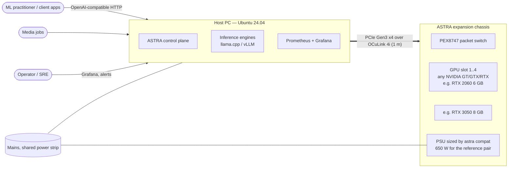
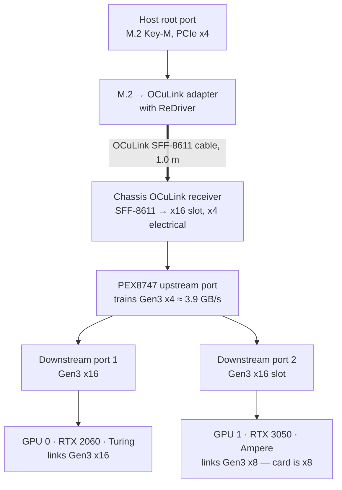
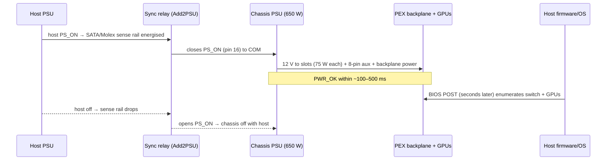
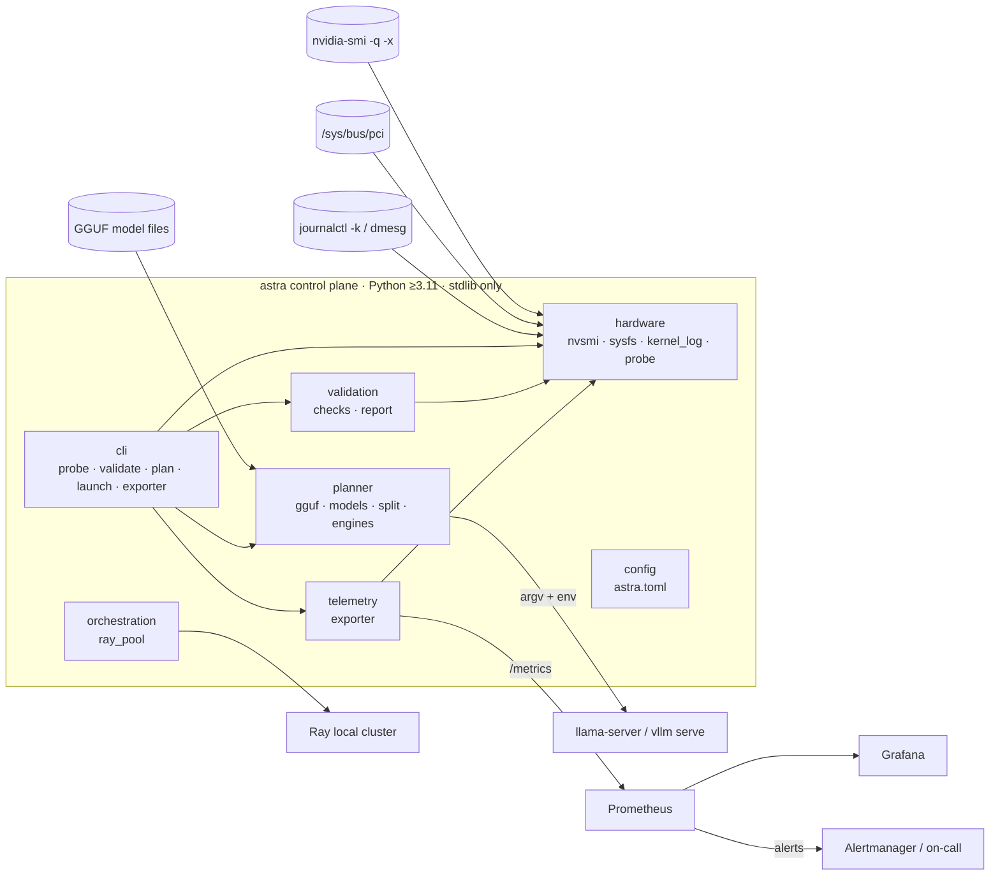
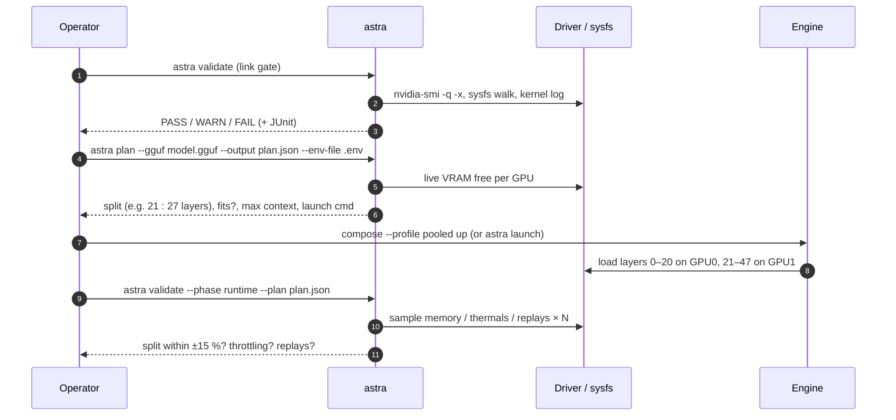

# ASTRA — System Architecture

| | |
|---|---|
| Document ID | ASTRA-ARC-001 |
| Version | 1.0 (2026-09-23) |
| Status | Draft — baselined at Gate G2 |
| Owner | Enterprise Architect |
| Inputs | Concept document (as-received), PRD ASTRA-REQ-001, [design review](design-review.md) |

## 1. Architectural drivers

| Driver | Source | Consequence |
|---|---|---|
| Use hardware already owned; one M.2 slot; no bifurcation | PRD §1, §5 | PCIe packet switch in the chassis (ADR-0002) |
| Lowest-overhead external link | PRD NFR-05 | Native PCIe over OCuLink, not USB4/TB (ADR-0001) |
| GPUs with different VRAM and architectures, no P2P | PRD §5 | Pipeline (layer) parallelism with a VRAM-weighted split (ADR-0003) |
| Device identity must survive reboots and host GPUs | FR-04, FR-08 | UUID addressing, PCI-bus order (ADR-0004) |
| Must be provable and operable | FR-02, FR-05, FR-06 | Link/runtime gates and a purpose-built exporter (ADR-0005, ADR-0007) |
| Any NVIDIA GPU mix, changing over time (CR-001) | FR-13–15 | Capability catalog, compatibility and power gate (ADR-0009); speed-aware GPU selection (ADR-0010) |

## 2. System context

## 3. Hardware view

### 3.1 PCIe topology

* The switch gives each GPU its own endpoint and bus number, so the OS sees two
  ordinary GPUs. No host bifurcation is needed.
* **The shared bottleneck is the x4 uplink.** nvidia-smi reports only the GPU↔switch
  link (x16/x8), so the control plane walks sysfs to measure the uplink (L05).
* GeForce drivers disable peer-to-peer. GPU-to-GPU data goes GPU0 → host RAM → GPU1
  and crosses the uplink twice. Pipeline parallelism keeps this traffic tiny
  (one hidden-state vector per token per stage boundary). Tensor parallelism would
  all-reduce on every layer.

### 3.2 Power and grounding

The rules are specified in [hardware-design.md](../03-solution-design/hardware-design.md):

* **Single source:** each GPU's slot power and aux 8-pin come only from the
  chassis PSU. Nothing from the host PSU feeds the chassis except the relay sense
  line.
* **Common earth:** both PSUs plug into the same power strip. Signal ground is
  shared through the OCuLink ground conductors.
* **No hot-plug:** the cable is connected or disconnected only with both systems off.
* **No host sleep:** S3/S4 drops the sense rail and powers off the chassis (DR-05).

## 4. Software view

### 4.1 Components

| Component | Responsibility | Key decisions |
|---|---|---|
| `hardware` | Read-only discovery through the driver (XML), sysfs and the kernel log; GPU capability catalog and compatibility/power analysis | Injected `CommandRunner` / `SysfsReader` ports so every path is unit-testable (ADR-0005); any NVIDIA GPU (ADR-0009) |
| `planner` | Model memory profile → GPU-set selection → contiguous split → engine launch spec | Balanced (ADR-0003) or speed-aware (ADR-0010) DP; exact sizes from GGUF tensor tables |
| `validation` | Link gate L01–L12, runtime gate R01–R05; JSON/Markdown/JUnit reports | Each check maps to requirement IDs; one crashing check never hides the others |
| `telemetry` | Prometheus exporter with a rate-limited collector | No DCGM dependency (ADR-0007) |
| `orchestration` | Ray typed resources (`gpu_turing`, `gpu_vram_8g`, …) | Optional extra; the core has no Ray dependency |

### 4.2 Workload flows

### 4.3 Deployment modes

| Mode | Profile | GPUs | When |
|---|---|---|---|
| Pooled (llama.cpp) | `pooled` | All, pipeline split | Default for models larger than any single GPU |
| Pooled (vLLM) | `vllm` | All, PP with `VLLM_PP_LAYER_PARTITION` | Higher concurrency with AWQ/GPTQ models (see R-04) |
| Partitioned | `partitioned` | One per service (UUID) | Concept doc's "heterogeneous containerization" |
| Elastic | Ray | Any free GPU matching a typed resource | Batch or parallel jobs |
| Bare-metal | systemd `astra-inference` | Planned | Hosts without Docker; gated by `astra-selftest` |

## 5. Quality attributes and tactics

| Attribute | Tactic |
|---|---|
| Reliability | Boot self-test gates inference; systemd restart policies; alerts on GPU loss and link degradation |
| Safety | Single-source power, common earth, relay sync, no hot-plug, sleep masked |
| Performance | Pipeline parallel (minimal inter-GPU traffic); Gen3 x4 uplink verified at every boot |
| Testability | Hardware access behind ports; recorded fixtures for two driver schema generations; simulation mode |
| Security | Non-root services, hardened units, read-only containers, localhost binds |
| Portability | Stdlib-only core; Linux + Windows CI matrix |

## 6. Architecture decisions

See [`adr/`](adr/README.md). All ADRs are *Accepted* at G2 unless noted.
