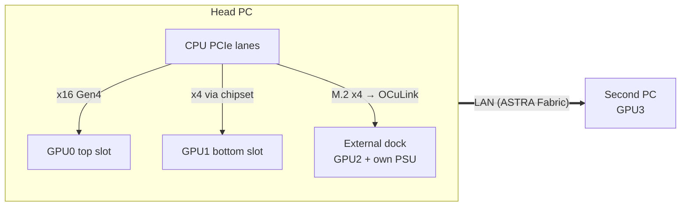

# Connecting more GPUs: x16, x8, x4, x1, external and over the network

| | |
|---|---|
| Document ID | ASTRA-SDD-HW-003 |
| Audience | Anyone adding a second, third or fourth GPU to an ASTRA machine |
| Related | [hardware-design.md](hardware-design.md) (chassis), [supported-gpus.md](supported-gpus.md), [field-test-plan.md](../05-testing/field-test-plan.md), ADR-0003 / 0010 / 0011 |

**Short answer:** for how ASTRA runs models (pipeline parallel: every GPU holds its own
block of layers), **x4 per GPU is plenty, x8/x16 mainly shortens model loading, and
even x1 works**. Link width barely changes generation speed. What matters is that each
GPU is **detected, powered correctly, and stable**, and ASTRA checks all three.

---

## 1. Bandwidth basics

A PCIe link has a **generation** (speed per lane) and a **width** (number of lanes:
x1, x4, x8, x16). Usable one-direction bandwidth:

| Width | Gen2 | Gen3 | Gen4 | Gen5 |
|---|---|---|---|---|
| x1 | 0.5 GB/s | 0.98 GB/s | 1.97 GB/s | 3.9 GB/s |
| x4 | 2 GB/s | 3.9 GB/s | 7.9 GB/s | 15.8 GB/s |
| x8 | 4 GB/s | 7.9 GB/s | 15.8 GB/s | 31.5 GB/s |
| x16 | 8 GB/s | 15.8 GB/s | 31.5 GB/s | 63 GB/s |

A link runs at the **lowest** generation and width of the two ends and everything in
between (slot, riser, adapter, cable, card). A Gen4 x8 card in a Gen3 x16 slot runs
Gen3 x8. The narrowest hop on the way to the CPU sets the speed.

## 2. How much link does ASTRA actually need?

The model is split into contiguous blocks of layers, one block per GPU. Only a small
**activation vector** crosses between GPUs: hidden size × 2 bytes per token (≈ 8 KB for
7–8B models, ≈ 10 KB for 14B, ≈ 16 KB for 70B). GeForce cards cannot send it to each
other directly, so it goes GPU → system RAM → GPU.

| What happens | Data over the link | x16 Gen3 | x4 Gen3 | x1 Gen3 | x1 Gen2 |
|---|---|---|---|---|---|
| **Generating one token** (per GPU boundary) | ~10 KB | < 0.01 ms | < 0.01 ms | 0.01 ms | 0.02 ms |
| **Reading a 4,096-token prompt** (per boundary) | ~40 MB | 3 ms | 10 ms | 41 ms | 82 ms |
| **Loading a 5 GB slice of the model** (once) | 5 GB | ~0.4 s | ~1.6 s | ~6 s | ~13 s |

A token takes ~7–30 ms to generate on these cards, so even x1 adds well under 1 %.
Prompts and loading are a little slower on narrow links. Your NVMe/SSD is often the
real limit for loading.

| Workload | Minimum per GPU | Comfortable |
|---|---|---|
| ASTRA pooled inference (llama.cpp, vLLM pipeline) | x1 Gen2 (works) | **x4 Gen3 or better** |
| Video encode/decode on one GPU (NVENC) | x4 Gen3 | x8 |
| Tensor-parallel inference / training (not ASTRA's default) | x8 Gen4 + P2P | x16 |

## 3. Every way to connect a GPU

| # | Method | Lanes per GPU | Typical cost | Good for | Watch out for |
|---|---|---|---|---|---|
| 1 | **Top x16 slot** on the motherboard (CPU lanes) | x16 | — | The fastest GPU | Usually only one per board |
| 2 | **Second / third x16-size slot** | **x8** (if the board splits CPU lanes x8/x8) or **x4** (chipset) | — | A 2nd GPU inside the PC | Manuals often say "x16 slot (x4 mode)". Chipset slots share the CPU link with USB/SATA/NVMe. Some boards disable M.2/SATA ports when the slot is used |
| 3 | **x1 slot** (open-ended, or with an x1→x16 adapter) | x1 | low | A small extra GPU | Slow model load; open-ended slots needed for long cards |
| 4 | **Ribbon riser cable** (x16, 15–30 cm) | same as the slot | low | Spacing, vertical mounting | Buy Gen4-rated; long or cheap risers cause errors (L07/L08 catch them) |
| 5 | **USB-cable "mining" riser** (PCIe x1 over a USB-3 cable; *not* USB) | x1 | low | Many GPUs on one board | x1 only; flaky contacts; **the riser board's power must come from the same PSU as that GPU** (§5) |
| 6 | **M.2 → PCIe slot adapter** (internal) | x4 | low | Using a spare M.2 slot | Needs a PCIe/NVMe M.2 slot, not SATA-only |
| 7 | **M.2 → OCuLink → external dock** | x4 | medium | A GPU outside the case (ASTRA Path A) | Not hot-pluggable; ≤ 1 m cable; the dock needs its own PSU |
| 8 | **Built-in OCuLink port** (mini PCs) | x4 (4i) or x8 (8i) | — | The ASTRA head mini PC | Same as 7 |
| 9 | **Bifurcation**: split one x16 slot into x8/x8 or x4/x4/x4/x4 with a passive card + risers/OCuLink | x8 or x4 each, **not shared** | medium | 2–4 GPUs from one slot (ASTRA Path B) | **BIOS must offer bifurcation** for that slot |
| 10 | **PCIe switch board** (Broadcom/PLX PEX, Microchip Switchtec, ASMedia-class) | uplink shared by 2–4 GPUs | higher | More GPUs than lanes, no BIOS support needed (ASTRA's chassis design) | GPUs share the uplink; Gen3 switches cap the speed at Gen3 |
| 11 | **Thunderbolt 3/4 / USB4 eGPU enclosure** | ≈ x4 Gen3 (~2.5–3 GB/s effective) | higher | Laptops; plug-and-play | One GPU per enclosure; protocol overhead; fine for pipeline inference |
| 12 | **Another PC over the network** (ASTRA Fabric) | network (1–10 GbE) | — | GPUs you already own in other machines | ~1–3 ms per token per machine boundary on 1 GbE; trusted LAN only |

### How to find out what a slot really is
1. The **motherboard manual** has a "PCIe configuration" or "lane sharing" table, e.g.
   "PCIEX16_2 runs x4 and disables M2_3 when populated".
2. After installing, **`astra probe`** shows each GPU's link as `Gen<current>/<max> x<current>/<max>`,
   and the console's GPU table has a *PCIe link* column. Idle GPUs drop to Gen1 to save
   power; check the **width** at idle, and the generation under load.

## 4. Example builds (mixing x16, x8 and x4)

| Build | How the GPUs connect | Links | Notes |
|---|---|---|---|
| **A. Your PC + 1 GPU** | GPU0 top slot, GPU1 bottom slot | x16 (CPU) + x4 (chipset) | Easiest first multi-GPU test (Stage 2) |
| **B. 3 GPUs in/around one PC** | top slot + bottom slot + M.2→OCuLink dock | x16 + x4 + x4 | The dock GPU needs its own PSU (§5) |
| **C. High-end board** | slots 1+2 split CPU lanes, slot 3 on chipset | x8 + x8 + x4 | Check the manual: populating slot 2 halves slot 1 |
| **D. Bifurcated x16 (ASTRA Path B)** | x4x4x4x4 card → 4 OCuLink cables → 4 GPUs | 4 × x4 (dedicated) | BIOS bifurcation required |
| **E. Switch chassis (ASTRA Path A)** | one OCuLink x4 (or x16) uplink → PEX switch → 2–4 GPUs | x16 per GPU to the switch, **x4 shared uplink** | Works on any host with M.2/OCuLink |
| **F. Two PCs** | PC1: 1–2 GPUs; PC2: 1–2 GPUs; LAN | local + network | ASTRA Fabric (`astra agent --rpc`) |



**How ASTRA uses a mixed build:** the planner never needs to know the widths to split
the model correctly. It places layers by **memory and speed**, and the link only affects
loading and long prompts. It *does* validate the links: `astra probe --emit-config`
records the detected topology (`require_switch` and the narrowest link as
`expected_uplink_width`/`gen`). From then on, **L05** fails if a link trains
narrower than when you set it up, for example after a riser comes loose.

## 5. Power: the single-source rule (important)

Every GPU draws up to **75 W through its slot** and the rest through its 8-pin/6-pin
connectors. **Both must come from the same power supply.**

| Where the GPU sits | Slot power comes from | So the GPU's 8-pin must come from |
|---|---|---|
| Motherboard slot | the PC's PSU (through the motherboard) | the **PC's PSU** |
| Riser/adapter with a power connector (USB riser, M.2 adapter, OCuLink dock) | **that connector** | the **same PSU that feeds the riser/dock** |
| ASTRA chassis / switch backplane | the chassis PSU (through the backplane) | the **chassis PSU** |

Mixing two PSUs on one GPU lets current flow between them through the card and can
damage it. For every PSU, check the total with `astra compat` (sustained ≤ 70 % of the
rating). If a second PSU powers external GPUs, both PSUs must share an earthed power
strip, and the second PSU must switch on with (or before) the PC (hardware design §3).

## 6. Adding a GPU, step by step

1. **Before buying:** `astra compat --simulate "<GPUs you have>, <new GPU>"`. It
   checks the driver window (Pascal and older force R580), engine support and the PSU
   size. `astra plan --simulate …` shows what the new pool can run.
2. **Power off and unplug.** Discharge static (touch the PSU case or wear a wrist strap).
3. **Install** the card in its slot/riser/adapter, screw the bracket in, and connect its
   power from the **correct PSU** (§5). Don't daisy-chain one cable to two high-power cards.
4. **BIOS:** enable *Above 4G Decoding*; for bifurcation set the slot to x8x8 or
   x4x4x4x4; leave link speed on *Auto* (set Gen3 if you later see errors).
5. **Boot and check:**
   ```text
   nvidia-smi -L                 # every GPU listed?
   astra probe                   # names, VRAM, link Gen/width per GPU
   astra compat                  # driver window, power, findings
   ```
   Compare each GPU's width with what the slot should give (§3). A card that shows x1
   in an "x4" slot usually means lane sharing or a bad riser.
6. **Freeze the as-built config:** `astra probe --emit-config > astra.toml` (Linux:
   `/etc/astra/astra.toml`), then `astra validate`. On Linux L04/L05/L08 also check
   the switch, the link widths and the PCIe error counters.
7. **Or simply run `astra auto`**: it re-detects every GPU, notices the change, and
   picks, launches and verifies the best model for the new pool.
8. **Run a model across all GPUs:** `scripts\stage0-test.ps1 -Model 7b` (Windows) runs
   the full test on however many GPUs ASTRA finds: plan → engine → speed → runtime
   gate. Or do it by hand: `astra plan --gguf <model> --output plan.json`, run the
   printed command, then `astra validate --phase runtime --plan plan.json`. The console
   (`astra ui`) shows which layers landed on which GPU.

## 7. Troubleshooting

| Symptom | Likely cause | Fix |
|---|---|---|
| New GPU missing from `nvidia-smi` | No power cable / PSU off; driver too new for a Pascal/Maxwell card; BAR space | Check cables; `astra compat` (install R580 if needed); BIOS *Above 4G Decoding* |
| GPU shows **x1** or **x2** in an x4/x16 slot | Slot shares lanes with an M.2/SATA port; riser or adapter only wired x1 | Manual's lane table; move the card or free the shared M.2 |
| Link shows **Gen1** | Idle power saving (normal) | Re-check under load: the generation should rise |
| PCIe replays/AER errors (L07/L08), random crashes, "GPU has fallen off the bus" | Long/cheap riser, loose OCuLink, poor earthing | Shorter Gen4-rated riser; reseat; force Gen3 in BIOS; same power strip |
| Model loads slowly | Narrow link (x1) or slow disk | Expected on x1; use NVMe for models |
| Planner leaves a GPU out | It is slower or not needed (e.g. GT 1030) | Normal. `--gpus all` forces it in; `planner.exclude_gpus` always skips it |
| Engine error "no kernel image is available" | llama.cpp build lacks that card's architecture | Use a build containing it (`astra compat` prints `CMAKE_CUDA_ARCHITECTURES`) |
