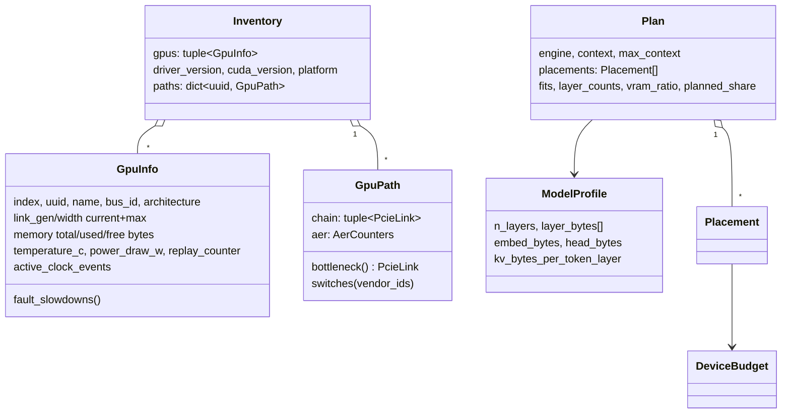

# ASTRA — Software Solution Design (control plane v0.2)

| | |
|---|---|
| Document ID | ASTRA-SDD-SW-001 |
| Version | 1.1 (2026-09-23): CR-001 |
| Status | Draft — approved at Gate G3 |
| Owner | Solution Architect · Approver: Enterprise Architect |
| Traces to | FR-01…FR-15, NFR-06…09; ADR-0003…0010 |

## 1. Package layout

```
src/astra/
├── cli.py                 argparse entry point `astra`; formatting; exit codes
├── config.py              astra.toml → frozen dataclasses; validation of values
├── errors.py              AstraError ▸ CommandError, ParseError, ConfigError, PlanningError
├── units.py               unit parsing ("8192 MiB", "8.0 GT/s PCIe"), PCIe bandwidth table
├── hardware/
│   ├── runner.py          CommandRunner port + SubprocessRunner adapter
│   ├── nvsmi.py           nvidia-smi -q -x → DriverReport(GpuInfo…) (schema-drift tolerant)
│   ├── sysfs.py           SysfsReader port + LocalSysfs; PCIe chain walk; AER counters
│   ├── kernel_log.py      fault signatures (Xid, AER, BAR, link down) + journalctl/dmesg
│   ├── gpu_specs.py       GPU capability catalog (bandwidth, power, NVENC, lanes) + architectures
│   ├── compat.py          driver window, engine eligibility, CUDA archs, PSU budget (ADR-0009)
│   ├── models.py          GpuInfo, PcieLink, GpuPath(bottleneck), AerCounters, Inventory
│   └── probe.py           driver + topology → Inventory
├── planner/
│   ├── gguf.py            GGUF v2/v3 header + tensor table reader (no tensor data)
│   ├── models.py          ModelProfile; architecture catalog × quantization; from GGUF
│   ├── split.py           DeviceBudget, balanced/speed partition, GPU-set selection, Plan
│   └── engines.py         Plan → LaunchSpec (argv, env) for llama.cpp and vLLM
├── validation/
│   ├── checks.py          link gate L01–L12, runtime gate R01–R05
│   └── report.py          Report → table | JSON | Markdown | JUnit XML
├── telemetry/exporter.py  rate-limited Collector; Prometheus text rendering; HTTP server
└── orchestration/ray_pool.py  typed Ray resources (optional extra)
```

Dependency rule: `cli` → {`validation`, `planner`, `telemetry`} → `hardware` →
`units`/`errors`. Nothing imports `cli`, and `hardware` imports nothing above it.

## 2. Data model



All records are frozen dataclasses. `Inventory.to_dict()` and `Plan.to_dict()` are
the JSON contracts used by `probe --json`, `plan --output`, and
`validate --phase runtime --plan`.

## 3. Key algorithms

### 3.1 Uplink bottleneck (FR-01, FR-02)
`/sys/bus/pci/devices/<bdf>` resolves to a path such as
`/sys/devices/pci0000:00/0000:00:1b.4/0000:02:00.0/0000:03:08.0/0000:04:00.0`. Every
path component that is a BDF is a hop, from the root port down to the GPU. For each
hop the code reads `current_link_speed`/`current_link_width`/`max_*`,
`vendor`/`device`/`class` and `aer_dev_*`. The **bottleneck** is the hop with the
lowest `lane_rate(gen) × width`. The **switch** is a bridge (`class 0x0604xx`)
whose vendor is in `interconnect.switch_vendor_ids`.

### 3.2 Split planning (FR-03, ADR-0003)
Inputs: a model profile (per-layer bytes; embeddings; head; KV bytes per token per
layer), GPU budgets in PCI order (`capacity = min(total × util, free now)`,
`reserve`), the engine and the context length.

```
usable_i = capacity_i − reserve_i
fixed    = [0…0]; fixed[last] += head; if engine == vllm: fixed[0] += embed
load(l)  = layer_bytes[l] + kv_per_token_layer × context
best(i, s) = min over e in (s, n−(k−i−1)]  of  max( (fixed_i + Σ load[s:e]) / usable_i , best(i+1, e) )
```

The DP is memoised, O(k·n²) (48 layers × 2 GPUs is trivial). `max_context` is the
largest context for which the optimum is ≤ 1.0, found by binary search over
[1, 2²⁰]. Warnings are raised for budgets reduced by other processes, plans that
don't fit, pooling that one GPU could handle alone, and pre-Ampere GPUs with vLLM.

### 3.2a Speed objective and GPU-set selection (FR-14, ADR-0010)
* `speed`: a DP builds the Pareto front of (Σ bytes_i / bandwidth_i, worst
  utilisation) over splits with every GPU ≤ 92 % full, then takes the most even
  split within 3 % of the fastest time.
* `select_gpus`: every subset of eligible GPUs (engine-capable, not in
  `planner.exclude_gpus`, ≤ 8) is planned. Ranking: fits → fits with margin (≤ 92 %)
  → estimated speed (5 % tie band, then fewer GPUs).

### 3.2b Compatibility and power (FR-13, FR-15, ADR-0009)
`compat.analyse(gpus, driver, chassis_cfg, paths)` → per-GPU capabilities, findings
(fail/warn/info), the driver window `[max(min_branch), min(last_branch)]`, CUDA
architectures, and the PSU budget over chassis members (behind the switch, else
non-display GPUs).

### 3.3 Runtime verification (FR-05)
Take N samples at interval Δ. For each planned GPU compute
`delta = peak used − baseline used`, where the baseline is recorded in the plan.
Actual share = `delta / Σ delta`. Expected share is `planned_share` for llama.cpp,
or `capacity_i / Σ capacity` for vLLM (which pre-allocates). The check fails when
any GPU deviates by more than `runtime_tolerance` or allocated < 256 MiB.

## 4. Interfaces

### 4.1 CLI contract

| Command | Purpose | Output | Exit |
|---|---|---|---|
| `astra probe [--json]` | Inventory and PCIe paths | table / `Inventory` JSON | 0, 2 |
| `astra validate [--phase link\|runtime] [--plan F] [--format table\|json\|md\|junit] [--output F]` | Gates | report | **0 pass/warn, 1 fail**, 2 error |
| `astra plan (--model K [--quant Q] \| --gguf F) [--engine] [--context] [--kv-type] [--gpus auto\|all\|LIST] [--objective speed\|balanced] [--util] [--reserve-mib] [--simulate S] [--json] [--output F] [--env-file F]` | GPU selection + split planning | table / Plan JSON (with alternatives) / compose `.env` | **0 fits, 1 does not fit**, 2 error |
| `astra compat [--simulate S] [--driver V] [--psu-watts W] [--json]` | Compatibility + PSU budget for installed or hypothetical GPUs | table / JSON | **0 ok/warn, 1 fail**, 2 error |
| `astra probe --emit-config` | Freeze the installed chassis GPUs as `[[node.expected_gpu]]` | TOML | 0 |
| `astra launch … [--dry-run]` | Plan then exec the engine | engine process | engine's code, 1 if not fits |
| `astra exporter [--host] [--port]` | Metrics | HTTP `/metrics`, `/healthz` | — |
| `astra models` | Catalog | table | 0 |

Global options: `--config PATH` (else `$ASTRA_CONFIG`, `./astra.toml`,
`/etc/astra/astra.toml`, then built-in defaults), `-v`, `--version`.

### 4.2 Configuration schema
See [`config/astra.example.toml`](../../config/astra.example.toml). Unknown keys and
out-of-range values are rejected at load time (`ConfigError`, exit 2), so a typo
can't silently disable a check.

### 4.3 Metrics
See the catalog in [monitoring.md](../07-operations/monitoring.md). Every metric
carries `node`; GPU metrics also carry `gpu` (index) and `uuid`.

## 5. Error handling and logging

* Expected failures raise `AstraError` subclasses. The CLI prints
  `astra: error: …` and exits 2. Stack traces appear only for genuine bugs.
* Validation checks run in isolation. A crashing check becomes a FAIL result naming
  the exception, and the remaining checks still run.
* The exporter never dies on a failed sample. It sets `astra_up 0`, increments
  `astra_scrape_errors_total`, and `/healthz` returns 503.
* Logging goes through the `logging` module to stderr; under systemd it lands in
  the journal.

## 6. Security design (NFR-09)

* The control plane is read-only toward hardware. It never writes sysfs or changes
  driver settings.
* systemd units run as the `astra` user with `ProtectSystem=strict`, `NoNewPrivileges`,
  `PrivateTmp` and `ProtectHome`. The container runs as UID 10001 with a read-only
  root filesystem.
* Ports (exporter 9835, Prometheus 9090, Grafana 3000, inference 8080/8000) bind to
  127.0.0.1 by default. Exposing inference on the LAN requires setting `ASTRA_BIND`
  and putting it behind an authenticating reverse proxy.
* Secrets (Grafana admin password, HF token) live only in the untracked
  `deploy/compose/.env`.

## 7. Extension points

| To add… | Change |
|---|---|
| A new engine | `planner/engines.py` builder + `ENGINES` + fixed-cost placement in `split._fixed_costs` + a Compose profile |
| A new check | A function `LinkContext → CheckResult` appended to `LINK_CHECKS`, with requirement IDs, a unit test and a TC row |
| A new model family | An `Architecture` entry in `planner/models.CATALOG` (or plan straight from GGUF) |
| A Gen4 switch | Set `interconnect.expected_uplink_gen = 4` and add its vendor ID; no code change |
